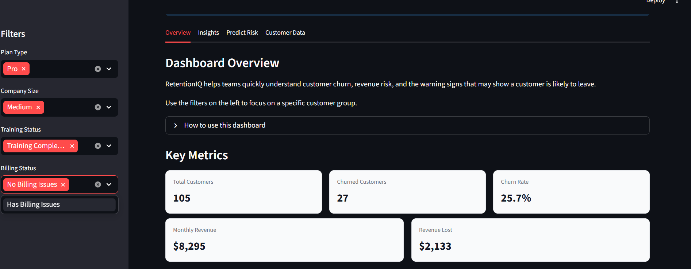
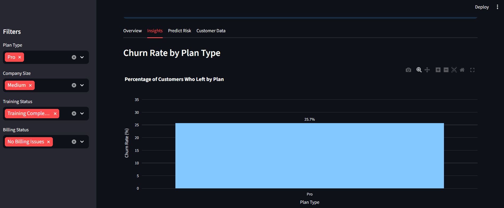
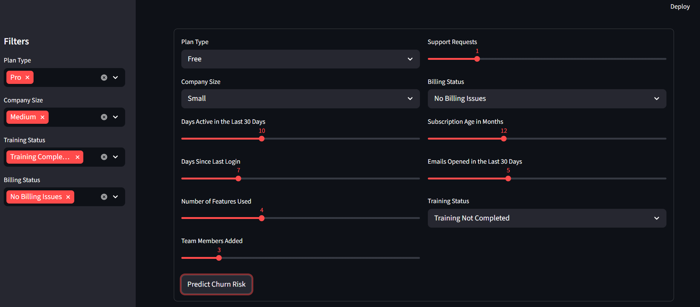
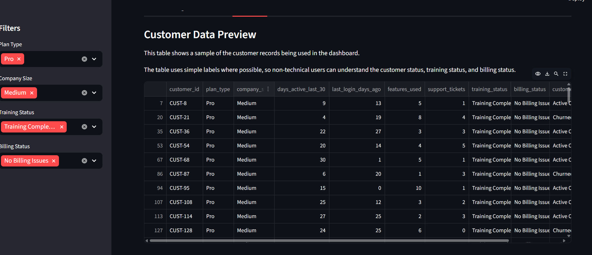

# RetentionIQ: SaaS Churn and Revenue Risk Dashboard

RetentionIQ is a machine learning dashboard that helps SaaS teams understand customer churn, monitor revenue risk, and identify customers who may need attention.

The project combines exploratory data analysis, churn prediction, and a Streamlit dashboard to turn customer behaviour data into practical retention insights.

## Live Demo

[Open RetentionIQ Dashboard](https://retentioniqdashboard.streamlit.app/)

## Project Overview

Customer churn is a major problem for SaaS businesses. When customers stop using a product or cancel their subscription, the business loses revenue and growth becomes harder.

RetentionIQ helps answer questions such as:

* Which customers are more likely to leave?
* What behaviours are linked to churn?
* How much revenue is at risk?
* Which customers may need support or follow-up?
* What action should the team take next?

## Key Features

* Interactive Streamlit dashboard
* Sidebar filters for customer groups
* KPI cards for customer and revenue summary
* Churn insights by plan type, activity level, feature usage, training status, and billing status
* Machine learning churn prediction form
* Churn risk score
* Risk level classification
* Suggested retention action
* Customer data preview with simple labels for non-technical users

## Dashboard Screenshots

### Overview



### Insights



### Prediction



### Customer Data



## Dataset

The project uses a synthetic SaaS customer dataset with 2,000 customer records.

The dataset includes customer behaviour and account information such as:

* Plan type
* Company size
* Days active in the last 30 days
* Days since last login
* Number of features used
* Support requests
* Billing issues
* Training completion
* Subscription age
* Monthly fee
* Churn status

The overall churn rate in the dataset is around 28%, which provides a realistic baseline for the project.

## Exploratory Data Analysis

The analysis showed that churn is strongly linked to:

* Low customer activity
* Low feature usage
* Incomplete training
* Billing issues
* High support activity
* Plan type

A deeper look at Pro users showed that their churn was more likely connected to low feature adoption than billing issues, support tickets, or training completion.

This suggests that some Pro users may not be using enough features to justify the higher subscription cost.

## Machine Learning Model

The selected model is a Balanced Logistic Regression model.

This model was chosen because churn prediction is not only about accuracy. In a retention use case, it is important to catch customers who are likely to leave early.

The model achieved a churn recall of about 71%, meaning it was able to identify many customers who eventually churned.

## Why Recall Matters

In churn prediction, missing an at-risk customer can be costly.

A false positive means the team may check on a customer who was not actually going to leave.

A false negative means the team misses a customer who may churn without any intervention.

For this reason, recall was more important than accuracy for this project.

## Dashboard Structure

The dashboard is organised into four sections:

### Overview

Shows the current filtered summary, including:

* Total customers
* Churned customers
* Churn rate
* Monthly revenue
* Revenue lost

### Insights

Shows churn patterns across customer groups, including:

* Plan type
* Activity level
* Feature usage
* Training status
* Billing status

### Predict Risk

Allows a user to enter customer details and get:

* Churn risk score
* Risk level
* Suggested retention action

### Customer Data

Shows the filtered customer records used in the dashboard.

## How to Run the Project Locally

1. Clone the repository.

2. Create and activate a virtual environment.

3. Install the required packages:

```bash
pip install -r requirements.txt
```

4. Run the Streamlit app:

```bash
streamlit run app.py
```

## Project Structure

```text
RetentionIQ/
│
├── app.py
├── requirements.txt
├── README.md
│
├── data/
│   └── saas_churn_data.csv
│
├── models/
│   ├── churn_model.pkl
│   └── model_features.pkl
│
├── notebooks/
│   ├── eda_analysis.ipynb
│   ├── model_training.ipynb
│   └── model_evaluation.ipynb
│
├── src/
│   └── generate_data.py
│
└── images/
```

## Business Value

RetentionIQ is designed to help SaaS teams move from reactive churn management to proactive customer retention.

Instead of waiting until customers leave, teams can use the dashboard to spot warning signs early and take action.

## Tools Used

* Python
* Pandas
* Scikit-learn
* Streamlit
* Plotly
* Joblib
* Git and GitHub

## Future Improvements

Possible next steps include:

* Add customer-level explanations for each prediction
* Add downloadable reports
* Add more advanced models
* Deploy the dashboard online
* Connect the dashboard to a real SaaS customer database
* Add retention playbooks for different risk levels

## Author

Built as a product data science portfolio project.
